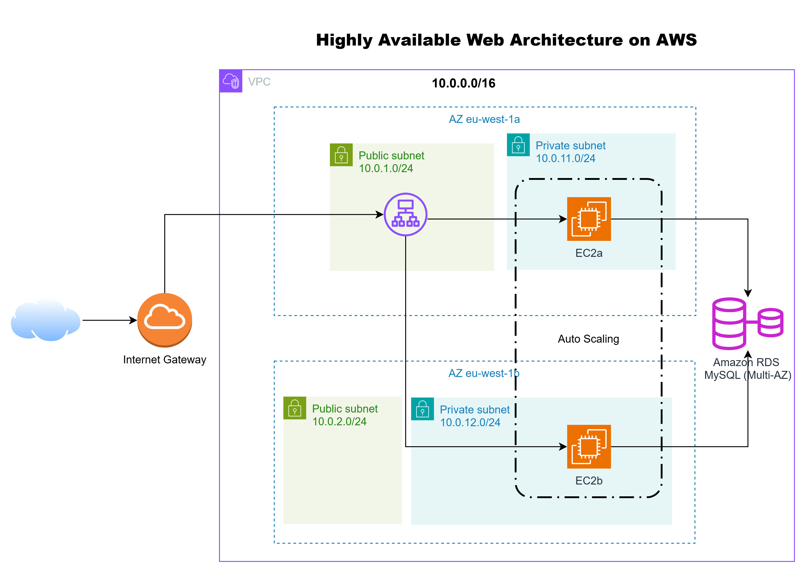

# High Availability Web Architecture on AWS

## Overview
This project demonstrates a secure and highly available web application architecture built on AWS using managed services and best practices.

## Architecture
The solution is designed with high availability and security in mind:
- VPC with public and private subnets across two Availability Zones
- Application Load Balancer deployed in public subnets
- Auto Scaling Group of EC2 instances in private subnets
- NAT Gateway for controlled outbound connectivity
- Access to EC2 instances via AWS Systems Manager (no SSH)

## Traffic Flow
1. Users access the application through the Application Load Balancer
2. ALB forwards traffic to EC2 instances in private subnets
3. EC2 instances access AWS services through a NAT Gateway

## Security
- EC2 instances have no public IPs
- ALB is the only public entry point
- Security Groups enforce least privilege access
- No SSH access, managed through SSM

## Resilience
- Multi-AZ deployment
- Auto Scaling Group ensures self-healing
- Health checks via Application Load Balancer

## Technologies Used
- Amazon EC2 (Amazon Linux 2023)
- Application Load Balancer
- Auto Scaling Group
- Amazon VPC & NAT Gateway
- AWS Systems Manager

## Author
Narjiss
